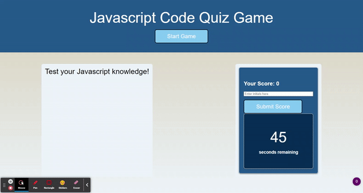
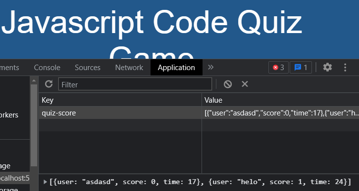

# Code-Quiz

## Description 

Welcome to Code Quiz.

This project aims to showcase my ability in utilizing Web APIs by presenting a quiz game with dynamically updating questions alongside a timer: 


and storing user scores locally:


## Usage

In order to do this project, I used Web APIs, Javascript, HTML, CSS, git and github.

I reference and manipulate HTML elements through Web API's querySelector() and getElementById() methods.
```
//variables connecting to elements on page
var startButton = document.querySelector(".start-button");
var submitButton = document.getElementById("submit-button");
```

I stored user scores locally by utilizing JSON stringify and JSON parse to store objects as strings.
```
//button listener for submitting user score and initials
submitButton.addEventListener("click", function() {
    var userInitial = document.getElementById("user-initial").value;
    var previousScore = JSON.parse(localStorage.getItem("quiz-score")) || []
    previousScore.push({user: userInitial, score: currentScore, time: timerCount}) 
    localStorage.setItem("quiz-score", JSON.stringify(previousScore));
})
```

## Links

[Deployed Website](https://zzzorigtbaatar.github.io/Code-Quiz/)

[Project Repository](https://github.com/zzzorigtbaatar/Code-Quiz)

## Credits

* Jerome Chenette, UC Berkeley Extension Coding BootCamp

* https://www.w3schools.com/js/js_api_intro.asp

* https://developer.mozilla.org/en-US/docs/Web/API

## License

[LICENSE](/LICENSE)

## Contact

https://www.linkedin.com/in/zorizulkhuu/

https://zzzorigtbaatar.github.io/My-Portfolio